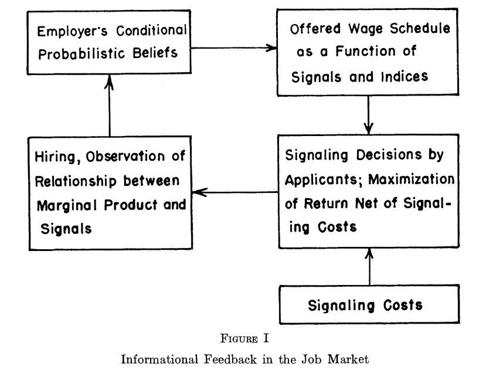
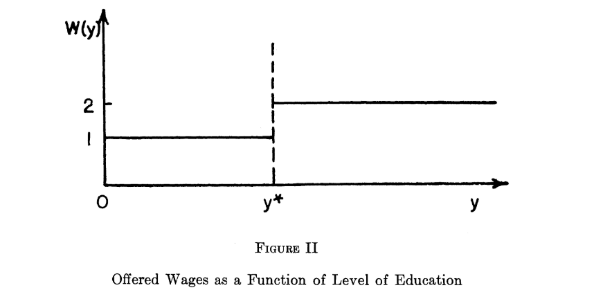

```{r setup, include=FALSE}
knitr::opts_chunk$set(echo = TRUE)
```

### Reference

1. Spence(1973), but ignore the section 6 about indices such as race or gender.
2. Course Tutorial(Video, E-book, Scripts, Slides)

## makecondition

```{r}
library(reticulate)
```

```{python}
from numpy.random import default_rng
from numpy import mean
```

### Reference about the Candidate Class





#### Reference Note

0. 求職市場有兩個部門：求職者（Candidate）以及雇主（Employer）。

1. 一個求職市場，或者說一個職缺，只有一個雇主。他會面對如雪片般飛來的履歷，每一次錄取對於雇主都像一次賭注，因為他不知道這個求職者究竟是人才還是庸才。庸才也不是問題，但是只怕他們沒有如雇主的需要去展現他們自己的價值（No Incentive Compability），也間接地沒辦法把他們各自安排在適合的位置，整體效率不夠好。

   - 僅使用 Spence 模型架構的倒數設定。

2. 參考 Figure1 （Employer's Conditional Probabilistic Beliefs），雇主會決定看到特定教育水準以上，他會認定該位求職者是位人才，給他比較高的薪酬。反之未達該水準，他會認定該位求職者是為庸才。

3. 配合 Figure2，雇主會向市場，也就是廣大的求職者們宣告他能提供的薪酬水準，以及他認定人才的水準。

## Employer Class

Spence 模型說的是一個 job market（一個求職市場，或者一個職缺），只有一個雇主。所以用 class method 或者 instance method 去寫好像落差不大。但是考量 `Low`，`High`，`Wage_Schedule`，這幾個參數的微調，包含高低薪酬的落差，以及 `Wage_Schedule` 以及比較靠近哪一邊，多少是可以反應雇主的性質。

所以有異質性成份，本質上也是 instance of Employer Class。像是 TSMC 和 Google 終究是不一樣的。

最後決定沒有用 class method。

```{python}
class Employer:
    
    def __init__(self, Low, High, Wage_Schedule):
        self.Wage_Schedule=Wage_Schedule
        self.Low = Low
        self.High = High
       
    def Possible_Wage(self, Signal):
        Wage_Schedule = self.Wage_Schedule

        if(Signal >= Wage_Schedule):
          return self.High
        else:
          return self.Low

#EOF
```
