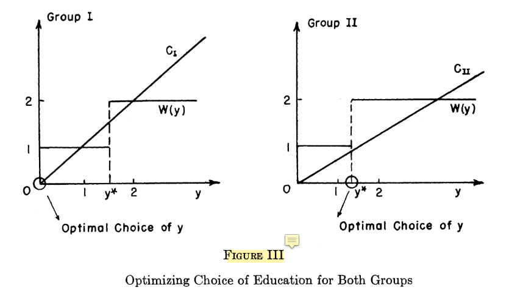

```{r setup, include=FALSE}
knitr::opts_chunk$set(echo = TRUE)
```

### Reference

0. Job Market Signaling Game
1. Spence(1973), but ignore the section 6 about indices such as race or gender.
2. Course Tutorial（Video, E-book, Scripts, Slides）

## makecondition

```{r}
library(reticulate)
```

```{python}
from numpy.random import default_rng
from numpy import mean
```

### Reference about the JobMarket Class





---

<br>
<br>

#### Reference Note

1. 當 employer 想好 Belief(包含 Low, High, Wage_Schedule)之後，他就會向市場宣告這些資訊。並且求職者看到這些資訊，進行 Signaling Decision 之後，就會進入聘用階段，也就是觀察求職者本身的 Group 和 Signal，是否有 incentive compability。也就是高能力者受較高水準的教育，低能力者受較低水準的教育。

   - 也就是市場呈現 Separating Eqm。

2. 如果沒有  incentive compability，那麼可能會得到兩種可能的狀況。

   - 不論高低能力者，皆是受低水準的教育，稱為 Pooling Eqm1。
   - 不論高低能力者，皆是受雇主宣告會認定為人才的標準（Wage_Schedule）。
   
3. 使用物件導向程式設計的 Composition Approach。

## JobMarket Class

1. Eqm 都必須要衡量兩個不同 Group 的求職者，他們最終的 Signaling Decision 如何。雇主是一位，求職者很多位，像是一對多的 Game；但是 candidate(instance) 終究是一位，有點像是最小顆粒度，雇主終究只能在看一份履歷。

2. 所以走兩輪相信是比較合理的。像是在聘用兩位求職者，雇主才能夠看得出來是否自己的 Belief 能夠幫助自己有效率地找到對的人。

```{python JobMarket}
class JobMarket:
  
  def __init__(self, employer, candidate):
    self.employer = employer
    self.candidate = candidate
  
  def Separating_Eqm(self):
    
    Group = self.candidate.Group
    Signal = self.candidate.Signal
    Wage_Schedule = self.employer.Wage_Schedule
    
    if ((Group == 1 and Signal == 0) or
        (Group == 2 and Signal == Wage_Schedule)):
        return "One more glance to check candidate from another Group(Type), therefore, the Separating Eqm will be more convincing."
    else:
        return "Check the scenario of Pooling Eqm."
      
  def Pooling_Eqm(self):
    
    q1 = self.candidate.__class__.q1
    Group = self.candidate.Group
    Signal = self.candidate.Signal
    Wage_Schedule = self.employer.Wage_Schedule

    if (Group == 2 and Signal == 0):
        return "The Group2(The talent) have no incentive to signal since q1*2 < Wage_Schedule: " + str(q1) + " * 2" + " < " + str(Wage_Schedule)
    elif (Group == 1 and Signal == Wage_Schedule):
        return "The Group1(The normal) are urged to signal by market structure since Wage_Schedule < 1-q1: " + str(Wage_Schedule) + " < " + "1-" + str(q1)
    else: 
        return "Check if there is Separating Eqm."

#EOF
```

### Concern

1. 目前是把 Equilibrium 相關的 methods，都放在 JobMarket Class 裡面。有點兩難是否應該放在 Employer Class 裡面，但是感覺以目前 Candidate Class 的寫法，會發生 `employer.candidate.__class__.candidate1toN[i].Group for i in range(Population)` 都看得到，言下之意雇主看得到 `q1`, `Uniform_Payoff`，這樣就沒有資訊不對稱了。

  - 雇主不僅看得到來應徵的那位（instance），也看得到整個求職者的分佈。感覺有點是因為架構 `candidate.__class__.candidate1toN` 的方式不夠好。所以最終還是把 Equilibrium 相關的 methods，單獨放在 JobMarket Class 裡面。但是並沒有表達到 Employer Class 其實隨著時間會像 JobMarket Class（Mr. JobMarket）一樣地思考並調整他的 Belief。

2. 但是另外一方面，employer 不可能窮盡所有的潛在求職者，因此他是錄取一個，衡量一個，修正過程是很慢的，也是有成本的。甚至他在這個職缺（或市場）始終都沒有做到分離均衡，團隊內薪酬相當齊值（或者相當接近），就是有 q1 的庸才，和 1-q1 的人才拿差不多的薪酬。
