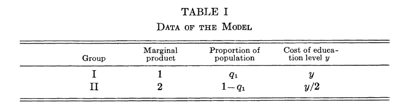
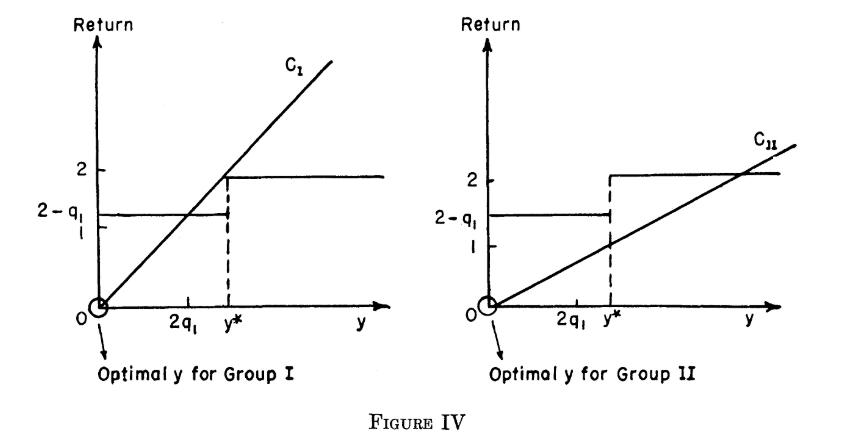

```{r setup, include=FALSE}
knitr::opts_chunk$set(echo = TRUE)
```

### Reference

0. Job Market Signaling Game
1. Spence(1973), but ignore the section 6 about indices such as race or gender.
2. Course Tutorial（Video, E-book, Scripts, Slides）

## makecondition

```{r}
library(reticulate)
```

```{python}
from numpy.random import default_rng
from numpy import mean
```


### Reference about the Candidate Class





---

<br>
<br>

#### Reference Note

0. 求職市場有兩個部門：求職者（Candidate）以及雇主（Employer）。

1. 求職市場上有兩種人（Group）：庸才和人才。人才的生產力是庸才的兩倍，接受教育的效率也是兩倍，所以成本是 1/2。

   - 僅使用 Spence 模型架構的倒數設定。

2. 市場上有 q1 比例的人是庸才，1-q1 比例是人才。基本上是上帝所決定的。

3. 透過 Figure4，在 Spence 模型中，人才會衡量雇主認定其為人才的門檻（y*），和選擇「不」做到鶴立雞群的預期報酬是多少？進而最佳化其教育水準（Signal），因此 q1，求職市場高手雲集的程度是所有求職者都知道的。

   - 進一步求職者知道如果大家的教育水準都相同，雇主預計會付多少（2-q1）。

## Candidate Class

> Class object is a generator. Any new object generated by it is an instance. In short, All objects when created are an instance of some class

```{python Candidate}
class Candidate: 
    
    candidate1toN = []
    
    #For Low, High and Wage_Schedule, the Candidate can view the information provided from the employer.
    def __init__(self, Group, Low, High, Wage_Schedule):
        assert (Group in (1,2)), "The candidate is either low-type(Group=1) or high-type(Group=2)"
        self.Group = Group
        self.employer = Employer(Low, High, Wage_Schedule)
        
        #Push up to the class variable(Homogeneous Attribute)
        Candidate.Low = self.employer.Low
        Candidate.High = self.employer.High
        Candidate.Wage_Schedule = self.employer.Wage_Schedule
        
        #candidate is part of the market.
        Candidate.candidate1toN.append(self)
        
    #Simple instance method
    def Signaling_Cost(self, Education):
       assert (Education >= 0), "Education level is >=0"
       Group = self.Group
       Signaling_Cost = Education/Group #negative correlation of costs and productivity.
       return Signaling_Cost
    
    #It has to wait the additional class methods: q1 and Uniform_Payoff
    def Optimal_Education(self):
      
        #class variable
        Low = Candidate.Low
        High = Candidate.High
        Wage_Schedule = Candidate.Wage_Schedule
        Uniform_Payoff = Candidate.Uniform_Payoff
        
        #instance variable
        Group = self.Group
        
        #Self-Evaluation
        Net_Return_of_Signal1 = Low - 0/Group
        Net_Return_of_Signal2 = High - Wage_Schedule/Group
        Net_Return_of_Signal3 = Uniform_Payoff - Wage_Schedule/Group
        
        #Consider the scenarios when the Signal is equal to Wage_Schedule.
        
        #Targeting the Group2(The talent)
        if max(Uniform_Payoff,Net_Return_of_Signal2)==Net_Return_of_Signal2:
            self.Signal = Wage_Schedule
            return Wage_Schedule
        
        #Targeting the Group1(The normal)
        elif max(Net_Return_of_Signal1,Net_Return_of_Signal3)==Net_Return_of_Signal3:
            self.Signal = Wage_Schedule
            return Wage_Schedule
        else:
            self.Signal = 0
            return 0
     
    #The first mind of the candidate is about the Population.
    @classmethod
    def Population(cls, N=500): #N=500 is default
      
        from numpy.random import default_rng
        rng_seed = default_rng()
        
        #Every instance will be appended by the syntax `Candidate.candidate1toN.append(self)`
        #The first element can be considered as our main character. So, we need N-1
        #candidate.__class__.candidate1toN return N Candidate instance
        Other_candidates_Initiation = [
          Candidate(Low=cls.Low,
                    High=cls.High,
                    Wage_Schedule=cls.Wage_Schedule,
                    Group = int(rng_seed.integers(low=1, #inclusive
                                                   high=3, #exclusive
                                                   size=1))) for i in range(N-1)
        ]
        Population = len(Other_candidates_Initiation) + 1
        
        #Push up to the class variable(Homogeneous Attribute).
        cls.Population = Population
        return Population
    
    
    #With the Population, candidate may consider if the market is competitive.
    @classmethod
    def q1(cls):
        
        from numpy import mean
        proportion = mean([cls.candidate1toN[i].Group for i in range(cls.Population)])
        Group1_proportion = 2-proportion
        
        #Push up to the class variable
        cls.q1 = Group1_proportion 
        return Group1_proportion
      
    #With q1, candidate can evaluate the Uniform_Payoff
    @classmethod
    def Uniform_Payoff(cls): 
      
        Low = cls.Low
        High = cls.High
        q1 = cls.q1 
        Uniform_Payoff = Low*q1 + High*(1-q1)
        
        #Push up to the class variable, so the `Optimal_Education` method can be done.
        cls.Uniform_Payoff = Uniform_Payoff
        return Uniform_Payoff

#EOF
```

### Simple Demo

#### Group1

```{python}
import EduSignal
Employer = EduSignal.Employer
```

```{python}
employer = Employer(Low=1, High=2, Wage_Schedule=0.4)
```

```{python}
candidate_Group1_instance = Candidate(Group=1, Low=1, High=2, Wage_Schedule=0.4)
```

```{python}
candidate_Group1_instance.__class__.High
candidate_Group1_instance.__class__.Low
candidate_Group1_instance.__class__.Wage_Schedule
candidate_Group1_instance.__class__.candidate1toN #Only himself
```

##### Class Method 

```{python}
candidate_Group1_instance.Population()
candidate_Group1_instance.__class__.candidate1toN[0:5] #First element in candidate1toN is our main character.
candidate_Group1_instance.__class__.Population
```

```{python}
candidate_Group1_instance.q1()
candidate_Group1_instance.__class__.q1
```

```{python}
candidate_Group1_instance.Uniform_Payoff()
candidate_Group1_instance.__class__.Uniform_Payoff
```

##### Instance Method 

```{python}
candidate_Group1_instance.Group
candidate_Group1_instance.Signaling_Cost(Education=1.3)
candidate_Group1_instance.Optimal_Education()
candidate_Group1_instance.Signal
```

#### Group2

```{python}
candidate_Group2_instance = Candidate(Group=2, Low=1, High=2, Wage_Schedule=0.4)
```

```{python}
candidate_Group2_instance.__class__.High
candidate_Group2_instance.__class__.Low
candidate_Group2_instance.__class__.Wage_Schedule
candidate_Group2_instance.__class__.candidate1toN[0:5]
```

##### Class Method 

```{python}
# candidate_Group2_instance.Population()
candidate_Group2_instance.__class__.candidate1toN[0:5]
candidate_Group2_instance.__class__.Population
```

```{python}
# candidate_Group1_instance.q1()
candidate_Group1_instance.__class__.q1
```

```{python}
# candidate_Group1_instance.Uniform_Payoff()
candidate_Group1_instance.__class__.Uniform_Payoff
```

##### Instance Method 

```{python}
candidate_Group2_instance.Group
candidate_Group2_instance.Signaling_Cost(Education=1.3)
candidate_Group2_instance.Optimal_Education()
candidate_Group2_instance.Signal
```

